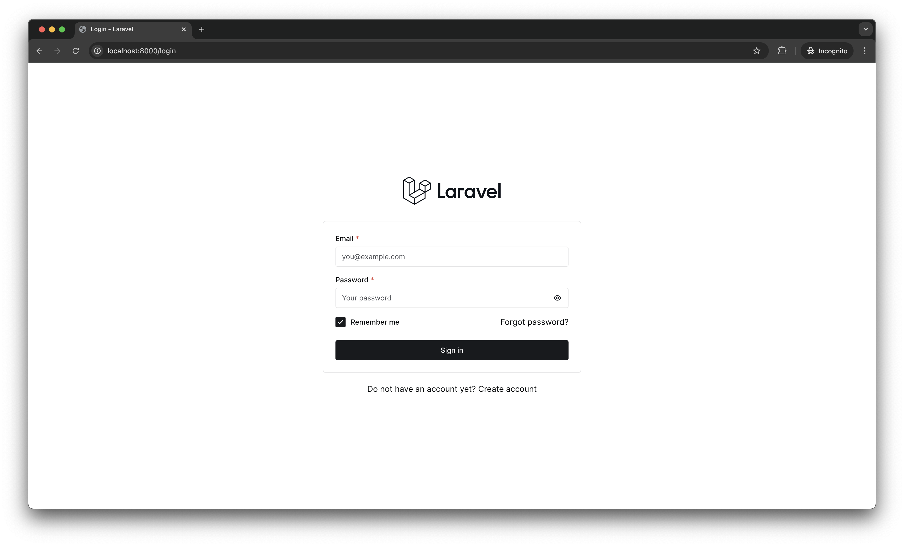
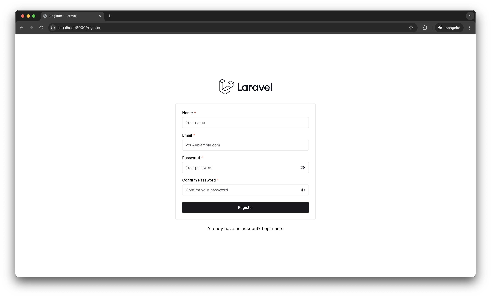
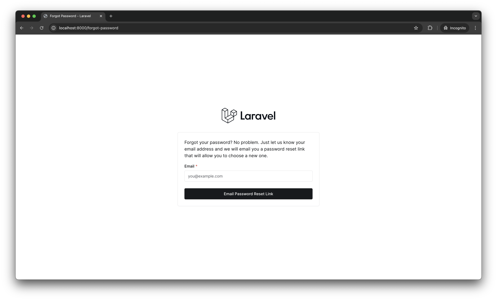
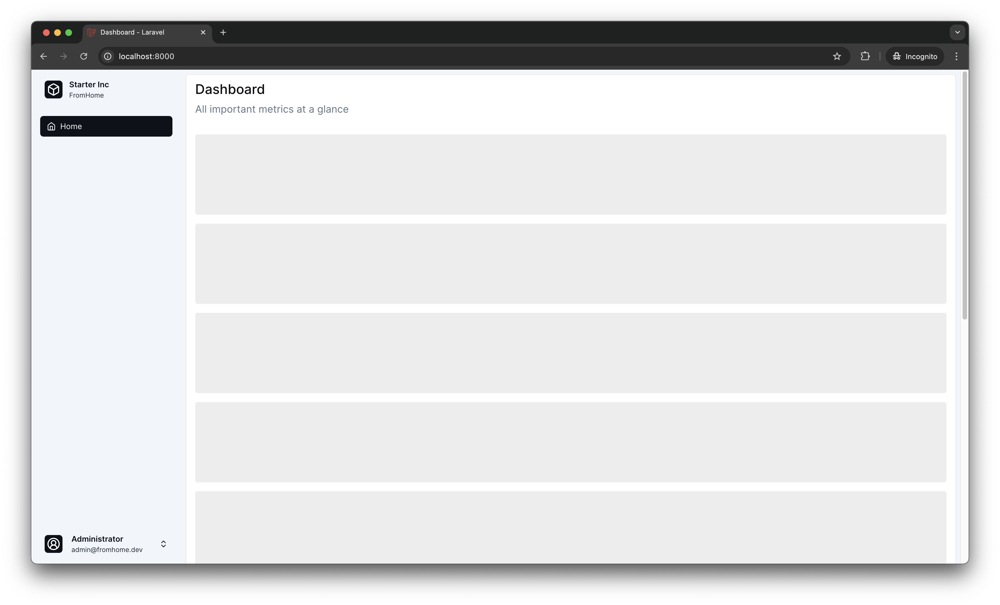
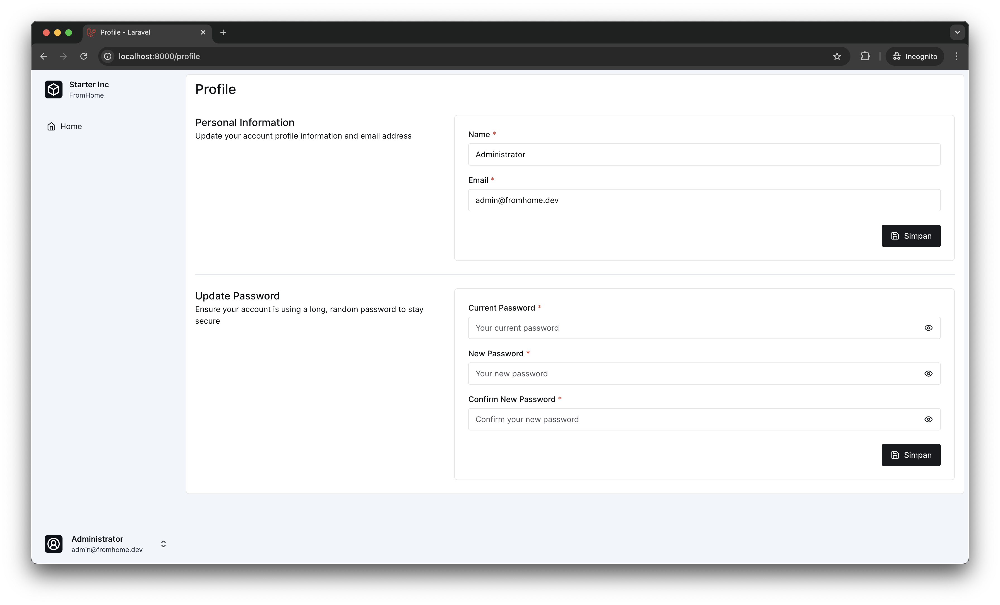
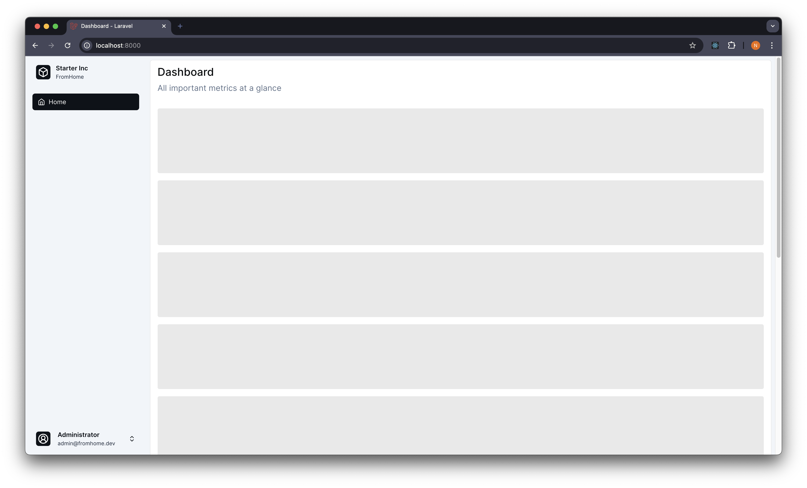
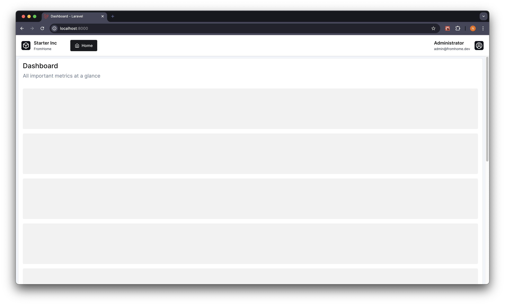

# Laravel Starter

This is Laravel starter project built using Laravel Fortify, Inertia and Chakra UI for UI. This starter already have

1. Login
2. Registration
3. Reset and change password
4. Layout and page template
5. Navigation menu

| | |
|:---:|:---:|
|  |  |
|  |  |
|  | |


## Installation

1. Clone the repository: `git clone https://github.com/your-username/your-repo.git` or using `Use this template` button in GitHub repository page
2. Install dependencies: `composer install` and `bun install`
3. Create a copy of the `.env.example` file and rename it to `.env`. Update the environment variables as needed.
4. Generate an application key: `php artisan key:generate`
5. Run the database migrations: `php artisan migrate --seed`
6. Build or watch a Inertia and Chakra UI : `bun run dev`
6. Start the development server: `php artisan serve`

Now you can open a `http://localhost:8000` in browser and login using `admin@fromhome.dev` and password is `password`

## Usage

### Enable or disable Fortify feature

This project using Laravel Fortify to handle auth, you can enable or disable feature in the config file. You can read detail in [this docs](https://laravel.com/docs/11.x/fortify#fortify-features)

> Warning!!! At the time, only `registration`, `resetPasswords`, `updateProfileInformation` and `updatePasswords` is implemented. Feature `emailVerification` and `twoFactorAuthentication` not implemeted yet.

### Application Layout

This project comes with two app layouts: `AppSidebarLayout` and `AppTopbarLayout`. By default, the project uses `AppSidebarLayout`. To change the layout, you can edit [`app.tsx`](https://github.com/atfromhome/laravel-starter/blob/3.x/resources/ts/app.tsx#L30)

| `AppSidebarLayout`      | `AppTopbarLayout`       |
|:-----------------------:|:-----------------------:|
|  |  |

### Register new menu

For a add new menu you can update a `NavigationServiceProvider`.

```php
private function registerNavigationGroups(): void
{
    Navigation::registerNavigationGroups([
        NavigationGroup::new()->menus([
            NavigationItem::new()
                ->label('Home')
                ->href('/')
                ->icon('home'),
        ]),
        NavigationGroup::new()->label('Setting')->icon('settings')->menus([
            NavigationItem::new()
                ->label('User')
                ->href('/users')
                ->icon('user-round-cog'),
            // Other menu for Setting
        ]),
        // Other group
    ]);
}
```

> This project using [Lucide](https://lucide.dev/) for icon library

## Contributing

Contributions are welcome! If you find any issues or have suggestions for improvements, please open an issue or submit a pull request.

## License

This project is licensed under the MIT License. See the [LICENSE](LICENSE) file for details.